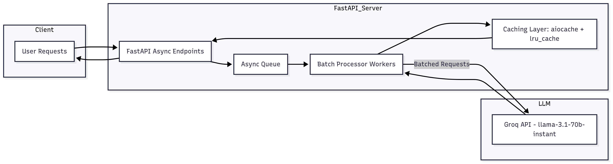

# **Scalable AI Agent with FastAPI (Research Paper Analyzer)**

## System Architecture Diagram:

## Purpose and Functionalities:
-This AI agent analyzes research papers by summarizing uploaded or provided text using Groq's llama-3.1-70b-instant model. Key features:
-High Concurrency Handling: Supports more than 10,000 concurrent requests on limited hardware -->

[test_results](Extra_files/Load_testing_results.pdf)

-Async Processing: Uses FastAPI’s async capabilities, batching, and task queues for efficiency.
-Caching: aiocache and lru_cache minimize repeated inference calls.
-Monitoring: Logs request latencies and throughput.

## High-Load Handling Strategies:
-Async Endpoints: Non-blocking request handling using Python's asyncio.
-Task Queue with Batching: Requests are batched before sending to Groq API, reducing API calls.
-Caching: Frequently requested summaries are cached.
-Backpressure: If the queue grows too large, rate limiting is applied.
-Uvicorn Workers: Uses multiple workers for CPU utilization while balancing memory usage.

## Concurrency Model:
-AsyncIO for concurrent I/O without extra threads.
-Task Queue using asyncio.Queue.
-Batch Processing Workers to send grouped requests to the LLM.
-aiocache for distributed caching.

📌**To simulate thousands of concurrent users hitting the system, Locust is used. It helps you check how well your system performs and scales under heavy load.**

**Trade-offs**
-Limited Hardware: We balance worker count and batch size for latency and throughput.
-Batch Size vs. Latency: Larger batches increase throughput but may delay responses.
-Caching Memory Cost: aiocache improves speed but uses memory.

## **RUNNING LOCALLY**:------------------------

Prerequisites:

-Python 3.11+
-Groq API Key

## 1. Clone the repository:
    git clone https://github.com/your-username/scalable-fastapi-agent.git
    cd scalable-fastapi-agent

## 2. Create .env following the .env.example:
    GROQ_API_KEY=your_groq_api_key_here

## 3. Install dependencies:
    pip install -r requirements.txt

## 4. Run the server:
    uvicorn main:app --reload --host 0.0.0.0 --port 8000

## 5. Test the endpoint:
    curl -X POST "http://127.0.0.1:8000/analyze" -H "Content-Type: application/json" -d '{"text": "Sample research paper content."}'

## **RUNNING WITH DOCKER**:----------------------

-Build and Run:

    docker-compose up --build

-Access:

Visit: http://localhost:8000/docs

-Endpoints:
POST: /analyze (Submit text for research analysis.)
GET: /status (Check service health and stats.)

📌 **Expected results and next steps:**----------------

The "/analyze" API generated a unique request_id (7b1a2367...). This ID is what your system uses to track the processing job.

-Status "queued" means:
The task has been handed off to your asynchronous worker queue (via your concurrency model, e.g., Celery or an in-process async background task). The worker will pick up this job and start processing (e.g., fetching, parsing, and summarizing the academic article).

-Next step for testing:

*Use your /status/{request_id} endpoint (or equivalent) to poll for completion:
    
GET /status/7b1a23676b974ae0a0.........

Once processed, you should see the final status change to something like "done" or "error" along with the processed summary or results.

# Locust:
    
-Open Locust Web UI at http://localhost:8089
    *Set Number of users (e.g., 10000).
    *Set Spawn rate (e.g., 500).
    *Click Start.

-!!!Scale workers if needed to increase load generation:

    docker-compose up --scale locust-worker=4 -d

This spins up four workers connected to the same master.

-Monitor resource usage:
    *docker stats — Check CPU/memory usage for containers.
    *Locust Web UI shows requests/sec, latency, failures, etc. 

## **Start Locust manually (if not running with docker):**---------------------------

-In another terminal (on your host machine):

    locust -f locustfile.py --host http://127.0.0.1:8000

-Open Locust Web UI at http://localhost:8089 and configure:
    -Number of users: e.g., 10000
    -Spawn rate: e.g., 500 (users per second)
    -Run the test and observe metrics such as average latency, p95 latency, throughput, and failures.

## Tips for Testing more Concurrent Requests:

-Use multiple Locust workers in distributed mode:

    # Start master-
        locust -f locustfile.py --host http://127.0.0.1:8000 --master

    # Start workers (run in separate terminals or machines)-
        locust -f locustfile.py --worker --master-host=127.0.0.1

-Gradually ramp up users to avoid overwhelming your machine.
-Monitor memory/CPU usage with htop or Docker stats to validate optimizations.